# Comprehensive Forecasting Service - Detailed Design Document

## 🎯 Executive Summary

This document provides the complete technical design for a **production-ready, enterprise-scale forecasting service** that handles the entire machine learning lifecycle from raw data ingestion to model deployment. The service features an intuitive chatbot-style UI similar to Jules, built on a microservices architecture with MLflow integration, supporting 6 forecasting algorithms, comprehensive preprocessing capabilities, and external regressor support.

## 🎨 Frontend UI Design - Chatbot Interface

The system features a modern, conversational UI that guides users through the forecasting process step-by-step, similar to Jules AI assistant.

### 🌟 UI Architecture Overview


### 💬 Conversational Flow Design


### 🎯 UI Component Specifications

#### 💬 Chat Interface Component
```typescript
interface ChatMessage {
  id: string;
  type: 'user' | 'assistant' | 'system';
  content: string;
  timestamp: Date;
  metadata?: {
    step: string;
    options?: Array<{
      label: string;
      value: string;
      description?: string;
    }>;
    attachments?: FileAttachment[];
  };
}

interface ChatInterfaceProps {
  messages: ChatMessage[];
  onSendMessage: (message: string) => void;
  onOptionSelect: (option: string) => void;
  onFileUpload: (files: File[]) => void;
  isLoading: boolean;
  currentStep: ProcessingStep;
}
```

#### 📊 Data Upload Component
```typescript
interface DataUploadProps {
  onFileUpload: (file: File) => void;
  supportedFormats: string[];
  maxFileSize: number;
  validationRules: ValidationRule[];
  previewData?: DataPreview;
}

interface DataPreview {
  columns: ColumnInfo[];
  sampleRows: any[];
  statistics: DataStatistics;
  issues: DataIssue[];
}
```

#### ⚙️ Configuration Panel Component
```typescript
interface ConfigurationPanelProps {
  step: 'preprocessing' | 'modeling' | 'evaluation';
  options: ConfigurationOption[];
  selectedOptions: Record<string, any>;
  onOptionChange: (key: string, value: any) => void;
  recommendations: Recommendation[];
}

interface ConfigurationOption {
  key: string;
  label: string;
  type: 'select' | 'multiselect' | 'range' | 'boolean' | 'text';
  options?: SelectOption[];
  defaultValue: any;
  description: string;
  dependencies?: string[];
}
```

#### 📈 Visualization Dashboard Component
```typescript
interface VisualizationDashboardProps {
  data: TimeSeriesData;
  forecasts: ForecastResult[];
  metrics: PerformanceMetrics;
  charts: ChartConfiguration[];
  interactive: boolean;
}

interface ChartConfiguration {
  type: 'line' | 'scatter' | 'bar' | 'heatmap' | 'distribution';
  title: string;
  data: any[];
  config: PlotlyConfig;
}
```

## 🏗️ System Overview

The Comprehensive Forecasting Service is a **cloud-native, horizontally scalable** machine learning platform designed to handle enterprise-scale time series forecasting workloads. The system features an intuitive chatbot-style interface that guides users through the entire forecasting process, from data upload to model deployment. The system processes raw time series data through an intelligent pipeline that automatically:

- **Analyzes data quality** and provides actionable insights
- **Cleans and transforms** data using 20+ preprocessing techniques
- **Engineers optimal features** specific to each algorithm type
- **Trains and compares** 6 different forecasting algorithms
- **Optimizes performance** through automated hyperparameter tuning
- **Tracks experiments** and manages model lifecycle with MLflow
- **Serves predictions** through high-performance REST APIs

### 🎯 Key Design Principles

1. **Modularity**: Each component is independently deployable and testable
2. **Scalability**: Horizontal scaling support for high-throughput workloads
3. **Reliability**: Comprehensive error handling and graceful degradation
4. **Observability**: Full logging, monitoring, and experiment tracking
5. **Flexibility**: Configurable pipeline with user-selectable components
6. **Performance**: Optimized for both accuracy and computational efficiency

### 📊 System Capabilities

| Capability | Specification | Performance Target |
|------------|---------------|-------------------|
| **Data Volume** | Up to 10M rows per dataset | <5 minutes processing |
| **Concurrent Users** | 100+ simultaneous requests | <2 second response time |
| **Algorithm Support** | 6 algorithms with auto-selection | >90% accuracy improvement |
| **Preprocessing** | 20+ transformation methods | Handles 95% of data quality issues |
| **Scalability** | Kubernetes-native deployment | Auto-scaling based on load |
| **Availability** | 99.9% uptime SLA | <1 minute recovery time |

## 🏗️ System Architecture

### 🌐 High-Level System Architecture


### 🔧 Microservices Architecture

The system is built using a microservices architecture with the following services:

| Service | Purpose | Technology Stack | Scaling Strategy |
|---------|---------|------------------|------------------|
| **API Gateway** | Request routing, auth, rate limiting | Kong/Nginx + JWT | Horizontal (3+ replicas) |
| **Data Ingestion** | File upload, validation, parsing | FastAPI + Pandas | Auto-scaling (1-10 replicas) |
| **EDA Service** | Exploratory data analysis | Python + Plotly | On-demand (0-5 replicas) |
| **Preprocessing Service** | Data cleaning, transformation | Scikit-learn + Pandas | Auto-scaling (2-20 replicas) |
| **ML Pipeline Service** | Model training, prediction | XGBoost + Prophet + Statsmodels | GPU-enabled (1-10 replicas) |
| **Evaluation Service** | Model comparison, metrics | NumPy + SciPy | CPU-optimized (1-5 replicas) |
| **MLflow Service** | Experiment tracking, registry | MLflow + PostgreSQL | Persistent (2 replicas) |
| **Model Store** | Model storage, versioning, deployment | MLflow + Redis | High-performance (3-50 replicas) |

### 🌊 Enhanced User Journey Flow


### 🔄 Detailed Workflow Architecture


### 🌊 Data Flow Architecture

```mermaid
---
config:
  theme: redux-dark-color
  look: handDrawn
---
sequenceDiagram
    participant U as 👤 User (Chat Interface)
    participant CHAT as 💬 Chat Orchestrator
    participant API as 🚪 API Gateway
    participant CONFIG as ⚙️ Config Manager
    rect rgb(230, 245, 255)
        Note over DI: 📥 DATA INGESTION PROCESS
        participant DI as Data Ingestion Engine
    end
    rect rgb(255, 245, 230)
        Note over PP: 🔄 PREPROCESSING PROCESS  
        participant PP as Data Preprocessing
    end
    rect rgb(240, 255, 240)
        Note over ML, MF: 🤖 MLOPS PIPELINE
        participant ML as ML Training Pipeline
        participant EV as Model Evaluation
        participant MF as MLflow Tracking
    end
    rect rgb(255, 240, 245)
        Note over MS: 🏪 MODEL SERVING PROCESS
        participant MS as Model Store & Serving
    end
    Note over U, MS: 🌟 TRAINING PHASE - CONVERSATIONAL ML PIPELINE
    U->>+CHAT: 💬 "I want to create forecasts from my sales data"
    Note right of U: Natural language interaction<br/>Conversational UI
    CHAT->>+API: 🚀 Initialize forecasting session
    Note right of CHAT: Context management<br/>Session tracking
    API->>+CONFIG: 🔍 Load default configuration templates
    Note right of CONFIG: Schema validation<br/>Parameter checking
    CONFIG-->>-API: ✅ Configuration templates ready
    API-->>-CHAT: 📋 Session initialized
    CHAT-->>U: 💬 "Great! Please upload your dataset. I support CSV, Excel, JSON, and Parquet files."
    
    U->>+CHAT: 📎 Upload dataset file
    CHAT->>+API: 📊 Process uploaded file
    API->>+DI: 📈 Raw data + session context
    Note right of DI: Enterprise data ingestion<br/>Multi-source support
    DI->>DI: 🔍 Data quality checks
    DI->>DI: 📋 Schema validation & mapping
    DI->>DI: 🗂️ Data cataloging & metadata
    DI->>DI: 🔄 Format standardization
    DI->>-API: 📊 Validated data + quality report
    API-->>-CHAT: 📋 Data validation results
    CHAT-->>U: 💬 "I found 1,825 rows with daily sales data. I detected some outliers and seasonal patterns. Would you like me to process this data?"
    
    U->>+CHAT: 💬 "Yes, please process the data"
    CHAT->>+API: ⚙️ Configure preprocessing pipeline
    API->>+PP: 📊 Execute preprocessing with user preferences
    PP->>+PP: 📊 Exploratory Data Analysis (EDA)
    Note right of PP: Statistical analysis<br/>Pattern detection
    PP->>PP: 🧹 Data cleaning & outlier detection
    PP->>PP: ⚡ Feature engineering & selection
    PP->>PP: 📏 Data scaling & normalization
    PP->>PP: ✂️ Train/validation/test split
    PP->>-API: 🎯 Processed feature matrix + report
    API-->>-CHAT: 📈 Preprocessing complete
    CHAT-->>U: 💬 "Data processed! I recommend XGBoost and Prophet algorithms based on your data patterns. Shall I train these models?"
    
    U->>+CHAT: 💬 "Train the recommended models"
    CHAT->>+API: 🤖 Start model training pipeline
    API->>+ML: 🎯 Processed data + algorithm selection
    Note over ML, MF: 🔥 MLOps Pipeline Active
    ML->>+ML: 🔄 Initialize multiple algorithms
    Note right of ML: AutoML capabilities<br/>Algorithm selection
    ML->>ML: 🎛️ Hyperparameter tuning
    ML->>ML: 🏋️ Cross-validation training
    ML->>ML: 📊 Generate model predictions
    ML->>-EV: 🔮 Model outputs & predictions
    EV->>+EV: 📏 Calculate performance metrics
    Note right of EV: RMSE, MAE, MAPE<br/>Custom metrics
    EV->>EV: 📊 Model comparison & ranking  
    EV->>EV: 📈 Generate evaluation reports
    EV->>EV: 🏆 Select champion model
    EV->>-MF: 📋 Evaluation results & metrics
    MF->>+MF: 📝 Log experiment parameters
    Note right of MF: Version control<br/>Reproducibility
    MF->>MF: 📊 Track model metrics & artifacts
    MF->>MF: 🏷️ Register champion model
    MF->>MF: 📦 Model lineage & governance
    MF->>-API: 🏆 Training results + champion model
    API-->>-CHAT: 🎉 Training complete with results
    CHAT-->>U: 💬 "Training complete! XGBoost achieved 8.2% MAPE. Here are your forecasts for the next 30 days. Are you satisfied with these results?"
    
    Note over U, MS: 🔮 INFERENCE PHASE - CONVERSATIONAL PREDICTIONS
    U->>+CHAT: 💬 "Export the forecasts and model"
    CHAT->>+API: 📊 Prepare export package
    API->>+MS: 🚀 Deploy model to serving layer
    MS->>+MS: 💾 Store model artifacts
    Note right of MS: Containerized deployment<br/>Auto-scaling ready
    MS->>MS: 🔧 Setup serving infrastructure
    MS->>MS: ⚡ Model optimization & caching
    MS->>MS: 🔒 Security & access control
    MS->>-API: ✅ Model deployment confirmation + export files
    API-->>-CHAT: 📦 Export package ready
    CHAT-->>U: 💬 "Perfect! I've exported your forecasts as CSV and Excel files, plus saved the trained model for future predictions. You can download everything now."
```



### 🧩 Component Architecture

The system follows a **layered microservices architecture** with clear separation of concerns and well-defined interfaces:

#### 🏗️ Architecture Layers


## 🎨 Comprehensive UI/UX Design Models

### 💬 Conversational Interface Design Patterns

#### **Chat Message Types & Templates**

```typescript
// Message type definitions for the chat interface
interface ChatMessageTemplate {
  type: 'welcome' | 'data_upload' | 'analysis_results' | 'configuration' | 'progress' | 'results' | 'error';
  template: string;
  interactive_elements?: InteractiveElement[];
  attachments?: Attachment[];
}

interface InteractiveElement {
  type: 'button' | 'file_upload' | 'dropdown' | 'checkbox' | 'slider' | 'chart';
  id: string;
  label: string;
  options?: Option[];
  validation?: ValidationRule[];
}

// Example message templates
const MESSAGE_TEMPLATES = {
  welcome: {
    type: 'welcome',
    template: `👋 Welcome! I'm your forecasting assistant. I'll help you create accurate forecasts from your time series data.

To get started, please upload your dataset:
- **Supported formats**: CSV, Excel, JSON, Parquet
- **Maximum size**: 100MB
- **Required**: Date column + numeric target variable`,
    interactive_elements: [
      {
        type: 'file_upload',
        id: 'dataset_upload',
        label: 'Upload Dataset',
        validation: ['file_size_max_100mb', 'supported_formats']
      }
    ]
  },
  
  data_analysis_results: {
    type: 'analysis_results',
    template: `🔍 **Data Analysis Complete!**

**Dataset Summary**:
- 📊 **{row_count} rows** with **{frequency}** frequency
- 📈 **Trend**: {trend_description}
- 🔄 **Seasonality**: {seasonality_description}
- ⚠️ **Issues**: {issues_found}

**Recommended Actions**:
{recommendations}

Would you like me to **apply these recommendations** or **customize the preprocessing**?`,
    interactive_elements: [
      {
        type: 'button',
        id: 'apply_recommendations',
        label: 'Apply Recommendations'
      },
      {
        type: 'button', 
        id: 'customize_preprocessing',
        label: 'Customize Preprocessing'
      }
    ]
  }
};
```

#### **Progressive Disclosure UI Pattern**


### 📊 Data Visualization Components

#### **Interactive Chart Specifications**

```typescript
interface ChartComponent {
  id: string;
  type: 'time_series' | 'distribution' | 'correlation' | 'performance' | 'forecast';
  config: PlotlyConfig;
  data: ChartData;
  interactions: ChartInteraction[];
}

interface ChartInteraction {
  type: 'zoom' | 'pan' | 'hover' | 'select' | 'brush';
  callback: (event: InteractionEvent) => void;
}

// Example: Time Series Chart with Forecast
const TIME_SERIES_CHART: ChartComponent = {
  id: 'main_forecast_chart',
  type: 'time_series',
  config: {
    layout: {
      title: 'Sales Forecast with Confidence Intervals',
      xaxis: { title: 'Date', type: 'date' },
      yaxis: { title: 'Sales' },
      hovermode: 'x unified'
    },
    traces: [
      {
        name: 'Historical Data',
        type: 'scatter',
        mode: 'lines',
        line: { color: '#1f77b4', width: 2 }
      },
      {
        name: 'Forecast',
        type: 'scatter', 
        mode: 'lines',
        line: { color: '#ff7f0e', width: 2, dash: 'dash' }
      },
      {
        name: 'Confidence Interval',
        type: 'scatter',
        fill: 'tonexty',
        fillcolor: 'rgba(255,127,14,0.2)',
        line: { color: 'transparent' }
      }
    ]
  },
  interactions: ['zoom', 'pan', 'hover']
};
```

#### **Dashboard Layout System**

```mermaid
graph TB
    subgraph "📱 Responsive Dashboard Layout"
        A[Header Bar - 60px]
        B[Progress Indicator - 40px]
        C[Main Content Area - Flexible]
        D[Chat Input - 80px]
    end
    
    subgraph "🖥️ Main Content Variants"
        E[Chat Only - Mobile]
        F[Chat + Side Panel - Tablet]
        G[Chat + Charts + Config - Desktop]
    end
    
    subgraph "📊 Chart Grid System"
        H[1x1 - Single Chart]
        I[2x1 - Comparison View]
        J[2x2 - Dashboard View]
        K[3x2 - Full Analysis]
    end
    
    C --> E
    C --> F
    C --> G
    
    G --> H
    G --> I
    G --> J
    G --> K
    
    style A fill:#e3f2fd
    style C fill:#f8f9fa
    style G fill:#e8f5e8
```



### ⚙️ Configuration Interface Models

#### **Smart Configuration Wizard**

```typescript
interface ConfigurationWizard {
  steps: ConfigurationStep[];
  current_step: number;
  user_selections: Record<string, any>;
  recommendations: Recommendation[];
}

interface ConfigurationStep {
  id: string;
  title: string;
  description: string;
  options: ConfigurationOption[];
  dependencies?: string[];
  validation?: ValidationRule[];
}

// Example: Preprocessing Configuration Wizard
const PREPROCESSING_WIZARD: ConfigurationWizard = {
  steps: [
    {
      id: 'missing_values',
      title: 'Missing Value Handling',
      description: 'How should I handle missing values in your data?',
      options: [
        {
          id: 'auto_imputation',
          label: 'Auto-Select Best Method',
          description: 'I\'ll choose the optimal imputation method based on your data patterns',
          recommended: true,
          complexity: 'beginner'
        },
        {
          id: 'knn_imputation', 
          label: 'KNN Imputation',
          description: 'Use similar time periods to fill missing values',
          complexity: 'intermediate',
          parameters: {
            n_neighbors: { type: 'slider', min: 3, max: 10, default: 5 }
          }
        },
        {
          id: 'custom_imputation',
          label: 'Custom Configuration',
          description: 'Full control over imputation parameters',
          complexity: 'advanced'
        }
      ]
    }
  ],
  current_step: 0,
  user_selections: {},
  recommendations: []
};
```

#### **Adaptive UI Based on User Expertise**


### 🔄 Real-time Progress & Feedback

#### **Progress Tracking Components**

```typescript
interface ProgressTracker {
  overall_progress: number; // 0-100
  current_step: ProcessingStep;
  step_progress: number; // 0-100
  estimated_time_remaining: number; // seconds
  detailed_status: StepStatus[];
}

interface StepStatus {
  step_name: string;
  status: 'pending' | 'in_progress' | 'completed' | 'failed';
  progress: number;
  message: string;
  start_time?: Date;
  end_time?: Date;
}

// Example: Model Training Progress
const TRAINING_PROGRESS: ProgressTracker = {
  overall_progress: 67,
  current_step: 'model_training',
  step_progress: 75,
  estimated_time_remaining: 120,
  detailed_status: [
    {
      step_name: 'Data Preprocessing',
      status: 'completed',
      progress: 100,
      message: 'Preprocessing complete - 32 features created',
      start_time: new Date('2024-01-15T10:00:00'),
      end_time: new Date('2024-01-15T10:02:30')
    },
    {
      step_name: 'XGBoost Training',
      status: 'completed', 
      progress: 100,
      message: 'Training complete - MAPE: 8.2%',
      start_time: new Date('2024-01-15T10:02:30'),
      end_time: new Date('2024-01-15T10:05:45')
    },
    {
      step_name: 'Prophet Training',
      status: 'in_progress',
      progress: 75,
      message: 'Training Prophet model... (3/4 components complete)',
      start_time: new Date('2024-01-15T10:05:45')
    },
    {
      step_name: 'Model Evaluation',
      status: 'pending',
      progress: 0,
      message: 'Waiting for training completion'
    }
  ]
};
```

#### **Real-time Notification System**


### 📱 Responsive Design Specifications

#### **Breakpoint System**

```css
/* Responsive breakpoints for forecasting interface */
:root {
  --mobile-max: 768px;
  --tablet-max: 1024px;
  --desktop-min: 1025px;
  --large-desktop-min: 1440px;
}

/* Mobile-first chat interface */
@media (max-width: 768px) {
  .forecasting-interface {
    grid-template-areas: 
      "header"
      "progress" 
      "chat"
      "input";
    grid-template-rows: 60px 40px 1fr 80px;
  }
  
  .chart-container {
    display: none; /* Hide complex charts on mobile */
  }
  
  .config-panel {
    position: fixed;
    bottom: 0;
    left: 0;
    right: 0;
    transform: translateY(100%);
    transition: transform 0.3s ease;
  }
  
  .config-panel.open {
    transform: translateY(0);
  }
}

/* Tablet layout with side panels */
@media (min-width: 769px) and (max-width: 1024px) {
  .forecasting-interface {
    grid-template-areas:
      "header header"
      "progress progress"
      "chat sidebar"
      "input sidebar";
    grid-template-columns: 2fr 1fr;
    grid-template-rows: 60px 40px 1fr 80px;
  }
  
  .chart-container {
    display: block;
    max-height: 300px;
  }
}

/* Desktop full-featured layout */
@media (min-width: 1025px) {
  .forecasting-interface {
    grid-template-areas:
      "header header header"
      "progress progress progress"
      "chat charts config"
      "input charts config";
    grid-template-columns: 1fr 2fr 1fr;
    grid-template-rows: 60px 40px 1fr 80px;
  }
  
  .chart-container {
    display: grid;
    grid-template-columns: 1fr 1fr;
    grid-gap: 16px;
  }
}
```

#### **Mobile-Optimized Chat Interface**

```typescript
interface MobileChatOptimizations {
  message_grouping: boolean; // Group consecutive messages
  quick_actions: QuickAction[]; // Swipe actions
  voice_input: boolean; // Speech-to-text support
  haptic_feedback: boolean; // Touch feedback
  offline_mode: boolean; // Cache for offline viewing
}

interface QuickAction {
  id: string;
  icon: string;
  label: string;
  action: () => void;
  swipe_direction: 'left' | 'right';
}

// Example mobile optimizations
const MOBILE_OPTIMIZATIONS: MobileChatOptimizations = {
  message_grouping: true,
  quick_actions: [
    {
      id: 'retry_action',
      icon: '🔄',
      label: 'Retry',
      action: () => retryLastAction(),
      swipe_direction: 'right'
    },
    {
      id: 'export_results',
      icon: '📊', 
      label: 'Export',
      action: () => exportResults(),
      swipe_direction: 'left'
    }
  ],
  voice_input: true,
  haptic_feedback: true,
  offline_mode: true
};
```

#### 🔗 Inter-Service Communication

| Communication Type | Use Case | Technology | Example |
|-------------------|----------|------------|---------|
| **Synchronous HTTP** | API requests, immediate responses | REST + JSON | User uploads data |
| **Asynchronous Messaging** | Long-running tasks, notifications | RabbitMQ/Kafka | Model training jobs |
| **Event Streaming** | Real-time updates, monitoring | WebSockets | Training progress |
| **Database Queries** | Data persistence, retrieval | PostgreSQL + Redis | Experiment metadata |
| **File Storage** | Large artifacts, models | S3/MinIO | Model binaries, datasets |

#### 🛡️ Security Architecture


**Security Features:**
- **Authentication**: JWT tokens with configurable expiration
- **Authorization**: Role-based access control (RBAC)
- **Data Encryption**: TLS 1.3 in transit, AES-256 at rest
- **Input Validation**: Schema validation, SQL injection prevention
- **Audit Logging**: Complete request/response logging
- **Rate Limiting**: Per-user and per-endpoint limits

## 🔧 External Regressors and Exogenous Variables System

### 🌐 External Regressor Architecture

The system provides comprehensive support for external regressors (exogenous variables) that can significantly improve forecast accuracy by incorporating external factors that influence the target variable.

```mermaid
graph TD
    subgraph "📊 Regressor Data Sources"
        A[Weather APIs<br/>OpenWeatherMap, NOAA]
        B[Economic Data<br/>FRED, World Bank]
        C[Marketing Data<br/>Google Ads, Facebook]
        D[Custom CSV Files<br/>User uploads]
        E[Database Connections<br/>SQL, NoSQL]
    end
    
    subgraph "🔍 Regressor Validation Engine"
        F[Data Quality Checker]
        G[Frequency Alignment]
        H[Missing Value Detection]
        I[Future Value Validator]
        J[Correlation Analysis]
    end
    
    subgraph "⚙️ Regressor Processing Pipeline"
        K[Data Synchronization]
        L[Preprocessing Application]
        M[Feature Engineering]
        N[Algorithm Integration]
    end
    
    subgraph "🤖 Algorithm-Specific Integration"
        O[Prophet Regressors]
        P[Tree Model Features]
        Q[SARIMAX Exogenous]
    end
    
    A --> F
    B --> F
    C --> F
    D --> F
    E --> F
    
    F --> K
    G --> K
    H --> K
    I --> K
    J --> K
    
    K --> O
    L --> P
    M --> Q
    
    style F fill:#e3f2fd
    style K fill:#fff3e0
    style O fill:#e8f5e8
```



### 📊 Regressor Data Model

```python
@dataclass
class ExternalRegressor:
    name: str
    source_type: str  # 'api', 'file', 'database'
    columns: List[str]
    frequency: str
    data_range: DateRange
    preprocessing_config: PreprocessingConfig
    future_strategy: FutureValueStrategy
    quality_metrics: DataQualityMetrics
    correlation_with_target: float
    importance_score: float

@dataclass
class FutureValueStrategy:
    method: str  # 'forecast', 'planned', 'seasonal', 'trend', 'scenario'
    parameters: Dict[str, Any]
    confidence_level: float
    fallback_method: Optional[str]

@dataclass
class RegressorValidationResult:
    is_valid: bool
    frequency_match: bool
    missing_value_percentage: float
    future_coverage: float
    correlation_strength: str  # 'strong', 'moderate', 'weak'
    recommendations: List[str]
    warnings: List[str]
```

### 🔧 Regressor Integration Strategies

#### 📈 Prophet Integration
```python
class ProphetRegressorManager:
    def add_regressor(self, name: str, prior_scale: float = 10.0, 
                     standardize: bool = True, mode: str = 'additive'):
        """Add external regressor to Prophet model"""
        
    def prepare_future_regressors(self, future_df: pd.DataFrame, 
                                 regressor_forecasts: Dict[str, pd.Series]):
        """Prepare future regressor values for forecasting"""
        
    def validate_regressor_data(self, regressor_data: pd.DataFrame) -> ValidationResult:
        """Validate regressor data quality and alignment"""
```

#### 🌳 Tree-Based Model Integration
```python
class TreeBasedRegressorManager:
    def create_regressor_features(self, regressors: Dict[str, pd.Series]) -> pd.DataFrame:
        """Create lag and rolling features from regressors"""
        features = {}
        for name, data in regressors.items():
            # Create lag features
            for lag in [1, 7, 14, 30]:
                features[f'{name}_lag_{lag}'] = data.shift(lag)
            
            # Create rolling statistics
            for window in [7, 14, 30]:
                features[f'{name}_rolling_mean_{window}'] = data.rolling(window).mean()
                features[f'{name}_rolling_std_{window}'] = data.rolling(window).std()
        
        return pd.DataFrame(features)
```

#### 📊 SARIMAX Integration
```python
class SARIMAXRegressorManager:
    def prepare_exogenous_matrix(self, regressors: Dict[str, pd.Series]) -> pd.DataFrame:
        """Prepare exogenous variable matrix for SARIMAX"""
        
    def forecast_with_exogenous(self, model: SARIMAX, 
                               future_exog: pd.DataFrame) -> ForecastResult:
        """Generate forecasts with future exogenous variables"""
```

## 🧩 Detailed Component Specifications

### 1. 📊 EDA Engine - Comprehensive Data Analysis Service

**Purpose**: Intelligent exploratory data analysis service that automatically discovers data patterns, quality issues, and provides actionable insights for time series forecasting.

#### 🔧 Technical Architecture

```python
class EDAEngine:
    """
    Advanced EDA engine with statistical analysis, pattern detection,
    and automated insight generation capabilities.
    """
    
    def __init__(self, data: pd.DataFrame, target_column: str, 
                 date_column: str, config: EDAConfig):
        self.data = data
        self.target_column = target_column
        self.date_column = date_column
        self.config = config
        self.insights = []
        self.visualizations = {}
        
    # Core Analysis Methods
    def analyze_data_frequency(self) -> FrequencyAnalysis:
        """Detect data frequency using multiple algorithms"""
        
    def detect_missing_patterns(self) -> MissingValueReport:
        """Identify missing value patterns and gaps"""
        
    def calculate_statistical_summary(self) -> StatisticalSummary:
        """Comprehensive statistical analysis"""
        
    def identify_seasonal_patterns(self) -> SeasonalityReport:
        """Detect seasonal patterns using STL decomposition"""
        
    def detect_trend_components(self) -> TrendAnalysis:
        """Analyze trend characteristics and changepoints"""
        
    def analyze_distribution(self) -> DistributionAnalysis:
        """Statistical distribution analysis and normality tests"""
        
    def detect_outliers_preliminary(self) -> OutlierSummary:
        """Initial outlier detection for EDA purposes"""
        
    def calculate_autocorrelation(self) -> AutocorrelationAnalysis:
        """ACF/PACF analysis for time series characteristics"""
        
    def generate_insights(self) -> List[Insight]:
        """AI-powered insight generation"""
        
    def create_visualizations(self) -> Dict[str, PlotlyFigure]:
        """Generate interactive visualizations"""
        
    def generate_eda_report(self) -> EDAReport:
        """Comprehensive EDA report with recommendations"""

@dataclass
class FrequencyAnalysis:
    detected_frequency: str  # 'D', 'W', 'M', 'H', 'irregular'
    confidence_score: float  # 0.0 to 1.0
    frequency_consistency: float  # Percentage of consistent intervals
    irregular_patterns: List[DateRange]  # Periods with irregular frequency
    recommendations: List[str]
    
@dataclass
class SeasonalityReport:
    has_yearly_seasonality: bool
    has_weekly_seasonality: bool
    has_daily_seasonality: bool
    seasonal_strength: Dict[str, float]  # strength scores 0-1
    seasonal_periods: Dict[str, int]
    decomposition_components: Dict[str, pd.Series]
    seasonality_tests: Dict[str, float]  # p-values from statistical tests
```

#### 🎯 Advanced Analysis Capabilities

| Analysis Type | Method | Output | Use Case |
|---------------|--------|--------|----------|
| **Frequency Detection** | Multiple algorithms (FFT, autocorr, mode) | Confidence-scored frequency | Data validation |
| **Seasonality Detection** | STL decomposition + statistical tests | Seasonal components | Algorithm selection |
| **Trend Analysis** | Changepoint detection (PELT, CUSUM) | Trend segments | Model configuration |
| **Distribution Analysis** | Normality tests, skewness, kurtosis | Distribution characteristics | Transformation selection |
| **Missing Pattern Analysis** | Gap analysis, MCAR/MAR/MNAR tests | Missing data mechanisms | Imputation strategy |
| **Outlier Screening** | Multiple detection methods | Outlier candidates | Data quality assessment |

#### 📈 Automated Insight Generation

```python
class InsightGenerator:
    """AI-powered insight generation using rule-based and ML approaches"""
    
    def generate_data_quality_insights(self, analysis: EDAReport) -> List[Insight]:
        """Generate insights about data quality issues"""
        insights = []
        
        if analysis.missing_percentage > 0.05:
            insights.append(Insight(
                type="data_quality",
                severity="warning",
                message=f"Dataset has {analysis.missing_percentage:.1%} missing values",
                recommendation="Consider advanced imputation methods",
                impact="May affect forecast accuracy by 10-20%"
            ))
            
        return insights
    
    def generate_seasonality_insights(self, seasonality: SeasonalityReport) -> List[Insight]:
        """Generate insights about seasonal patterns"""
        
    def generate_algorithm_recommendations(self, analysis: EDAReport) -> List[AlgorithmRecommendation]:
        """Recommend optimal algorithms based on data characteristics"""
```

#### 🎨 Interactive Visualization System

```python
class EDAVisualizationEngine:
    """Generate interactive visualizations using Plotly"""
    
    def create_time_series_plot(self) -> PlotlyFigure:
        """Interactive time series plot with zoom, pan, hover"""
        
    def create_seasonal_decomposition_plot(self) -> PlotlyFigure:
        """STL decomposition with trend, seasonal, residual components"""
        
    def create_distribution_plots(self) -> PlotlyFigure:
        """Histogram, Q-Q plot, box plot in subplots"""
        
    def create_autocorrelation_plots(self) -> PlotlyFigure:
        """ACF and PACF plots with confidence intervals"""
        
    def create_missing_value_heatmap(self) -> PlotlyFigure:
        """Heatmap showing missing value patterns"""
        
    def create_outlier_detection_plot(self) -> PlotlyFigure:
        """Scatter plot highlighting potential outliers"""
```

#### ⚡ Performance Optimizations

- **Lazy Loading**: Visualizations generated on-demand
- **Sampling**: Large datasets (>100K rows) automatically sampled for EDA
- **Caching**: Results cached using Redis for repeated analysis
- **Parallel Processing**: Multiple analysis tasks run concurrently
- **Memory Management**: Efficient DataFrame operations with chunking

### 2. 🧹 Data Preprocessing Engine - Advanced Data Transformation Service

**Purpose**: Enterprise-grade data preprocessing service with 20+ transformation methods, intelligent automation, and comprehensive quality assurance.

#### 🏗️ Preprocessing Pipeline Architecture


#### 🔧 Advanced Preprocessing Components

```python
class DataPreprocessingEngine:
    """
    Comprehensive preprocessing engine with intelligent automation,
    quality assurance, and detailed reporting capabilities.
    """
    
    def __init__(self, data: pd.DataFrame, config: PreprocessingConfig, 
                 external_regressors: Optional[Dict[str, pd.DataFrame]] = None):
        self.data = data
        self.config = config
        self.external_regressors = external_regressors or {}
        self.preprocessing_steps = []
        self.transformers = {}
        self.quality_metrics = {}
        
    # Core Preprocessing Methods
    def execute_preprocessing_pipeline(self) -> PreprocessingResult:
        """Execute complete preprocessing pipeline with error handling"""
        
    def handle_missing_values(self, method: str, **kwargs) -> pd.DataFrame:
        """Advanced missing value imputation with multiple methods"""
        
    def detect_and_handle_outliers(self, method: str, **kwargs) -> pd.DataFrame:
        """Integrated outlier detection and treatment"""
        
    def apply_data_transformations(self, transformations: Dict[str, str]) -> pd.DataFrame:
        """Apply mathematical transformations to improve data distribution"""
        
    def encode_categorical_variables(self, encoding_config: Dict) -> pd.DataFrame:
        """Advanced categorical encoding with cardinality handling"""
        
    def create_datetime_features(self, datetime_config: DateTimeConfig) -> pd.DataFrame:
        """Comprehensive datetime feature engineering"""
        
    def apply_data_scaling(self, scaling_config: ScalingConfig) -> pd.DataFrame:
        """Intelligent data scaling with outlier-robust methods"""
        
    def filter_and_clean_data(self, filters: List[DataFilter]) -> pd.DataFrame:
        """Apply data filters and cleaning rules"""
        
    def validate_data_quality(self) -> DataQualityReport:
        """Comprehensive data quality validation"""
        
    def generate_preprocessing_report(self) -> PreprocessingReport:
        """Detailed preprocessing report with before/after analysis"""

# Advanced Missing Value Imputation
class AdvancedImputer:
    """Sophisticated imputation methods for time series data"""
    
    def __init__(self, method: str, **kwargs):
        self.method = method
        self.kwargs = kwargs
        self.imputer = None
        
    def fit_transform(self, data: pd.DataFrame) -> pd.DataFrame:
        """Fit imputer and transform data"""
        if self.method == 'knn':
            return self._knn_imputation(data)
        elif self.method == 'iterative':
            return self._iterative_imputation(data)
        elif self.method == 'seasonal':
            return self._seasonal_imputation(data)
        elif self.method == 'interpolation':
            return self._interpolation_imputation(data)
            
    def _knn_imputation(self, data: pd.DataFrame) -> pd.DataFrame:
        """KNN-based imputation using similar time periods"""
        from sklearn.impute import KNNImputer
        
        # Create features for similarity matching
        features = self._create_similarity_features(data)
        imputer = KNNImputer(n_neighbors=self.kwargs.get('n_neighbors', 5))
        imputed = imputer.fit_transform(features)
        
        return pd.DataFrame(imputed, index=data.index, columns=data.columns)
    
    def _iterative_imputation(self, data: pd.DataFrame) -> pd.DataFrame:
        """Iterative imputation using regression models"""
        from sklearn.experimental import enable_iterative_imputer
        from sklearn.impute import IterativeImputer
        
        imputer = IterativeImputer(
            estimator=self.kwargs.get('estimator', None),
            max_iter=self.kwargs.get('max_iter', 10),
            random_state=42
        )
        
        imputed = imputer.fit_transform(data)
        return pd.DataFrame(imputed, index=data.index, columns=data.columns)

# Advanced Data Transformations
class DataTransformer:
    """Comprehensive data transformation methods"""
    
    @staticmethod
    def apply_box_cox_transform(data: pd.Series, lambda_param: Optional[float] = None) -> Tuple[pd.Series, float]:
        """Box-Cox transformation with automatic lambda selection"""
        from scipy import stats
        
        if lambda_param is None:
            transformed, lambda_param = stats.boxcox(data[data > 0])
        else:
            transformed = stats.boxcox(data[data > 0], lmbda=lambda_param)
            
        return pd.Series(transformed, index=data[data > 0].index), lambda_param
    
    @staticmethod
    def apply_yeo_johnson_transform(data: pd.Series, lambda_param: Optional[float] = None) -> Tuple[pd.Series, float]:
        """Yeo-Johnson transformation (handles negative values)"""
        from sklearn.preprocessing import PowerTransformer
        
        transformer = PowerTransformer(method='yeo-johnson', standardize=False)
        transformed = transformer.fit_transform(data.values.reshape(-1, 1)).flatten()
        
        return pd.Series(transformed, index=data.index), transformer.lambdas_[0]
    
    @staticmethod
    def create_polynomial_features(data: pd.DataFrame, degree: int = 2, 
                                 interaction_only: bool = False) -> pd.DataFrame:
        """Create polynomial and interaction features"""
        from sklearn.preprocessing import PolynomialFeatures
        
        poly = PolynomialFeatures(degree=degree, interaction_only=interaction_only, 
                                include_bias=False)
        transformed = poly.fit_transform(data)
        
        feature_names = poly.get_feature_names_out(data.columns)
        return pd.DataFrame(transformed, index=data.index, columns=feature_names)

# Advanced Categorical Encoding
class CategoricalEncoder:
    """Sophisticated categorical encoding methods"""
    
    def __init__(self, method: str, **kwargs):
        self.method = method
        self.kwargs = kwargs
        self.encoder = None
        
    def fit_transform(self, data: pd.DataFrame, target: Optional[pd.Series] = None) -> pd.DataFrame:
        """Fit encoder and transform categorical data"""
        if self.method == 'target':
            return self._target_encoding(data, target)
        elif self.method == 'binary':
            return self._binary_encoding(data)
        elif self.method == 'frequency':
            return self._frequency_encoding(data)
        elif self.method == 'onehot':
            return self._onehot_encoding(data)
            
    def _target_encoding(self, data: pd.DataFrame, target: pd.Series) -> pd.DataFrame:
        """Target encoding with regularization to prevent overfitting"""
        import category_encoders as ce
        
        encoder = ce.TargetEncoder(
            smoothing=self.kwargs.get('smoothing', 1.0),
            min_samples_leaf=self.kwargs.get('min_samples_leaf', 1)
        )
        
        encoded = encoder.fit_transform(data, target)
        return encoded
    
    def _binary_encoding(self, data: pd.DataFrame) -> pd.DataFrame:
        """Binary encoding for high-cardinality categorical variables"""
        import category_encoders as ce
        
        encoder = ce.BinaryEncoder()
        encoded = encoder.fit_transform(data)
        return encoded

# DateTime Feature Engineering
class DateTimeFeatureCreator:
    """Comprehensive datetime feature engineering"""
    
    @staticmethod
    def create_comprehensive_features(data: pd.DataFrame, date_column: str, 
                                    config: DateTimeConfig) -> pd.DataFrame:
        """Create comprehensive datetime features"""
        dt_data = pd.to_datetime(data[date_column])
        features = {}
        
        # Basic time features
        if config.include_basic:
            features.update({
                'year': dt_data.dt.year,
                'month': dt_data.dt.month,
                'day': dt_data.dt.day,
                'day_of_week': dt_data.dt.dayofweek,
                'day_of_year': dt_data.dt.dayofyear,
                'week_of_year': dt_data.dt.isocalendar().week,
                'quarter': dt_data.dt.quarter,
                'hour': dt_data.dt.hour,
                'minute': dt_data.dt.minute
            })
        
        # Cyclical features (sine/cosine encoding)
        if config.include_cyclical:
            features.update({
                'month_sin': np.sin(2 * np.pi * dt_data.dt.month / 12),
                'month_cos': np.cos(2 * np.pi * dt_data.dt.month / 12),
                'day_sin': np.sin(2 * np.pi * dt_data.dt.day / 31),
                'day_cos': np.cos(2 * np.pi * dt_data.dt.day / 31),
                'hour_sin': np.sin(2 * np.pi * dt_data.dt.hour / 24),
                'hour_cos': np.cos(2 * np.pi * dt_data.dt.hour / 24)
            })
        
        # Business calendar features
        if config.include_business:
            features.update({
                'is_weekend': dt_data.dt.dayofweek >= 5,
                'is_month_start': dt_data.dt.is_month_start,
                'is_month_end': dt_data.dt.is_month_end,
                'is_quarter_start': dt_data.dt.is_quarter_start,
                'is_quarter_end': dt_data.dt.is_quarter_end,
                'is_year_start': dt_data.dt.is_year_start,
                'is_year_end': dt_data.dt.is_year_end
            })
        
        # Holiday features
        if config.include_holidays:
            features.update(
                DateTimeFeatureCreator._create_holiday_features(dt_data, config.country)
            )
        
        return pd.DataFrame(features, index=data.index)
    
    @staticmethod
    def _create_holiday_features(dt_data: pd.Series, country: str = 'US') -> Dict[str, pd.Series]:
        """Create holiday-based features"""
        import holidays
        
        country_holidays = holidays.country_holidays(country)
        features = {}
        
        # Basic holiday indicator
        features['is_holiday'] = dt_data.dt.date.isin(country_holidays)
        
        # Days since/until holiday
        holiday_dates = pd.to_datetime(list(country_holidays.keys()))
        features['days_since_holiday'] = dt_data.apply(
            lambda x: min([abs((x - h).days) for h in holiday_dates if h <= x], default=365)
        )
        features['days_until_holiday'] = dt_data.apply(
            lambda x: min([abs((h - x).days) for h in holiday_dates if h > x], default=365)
        )
        
        return features

@dataclass
class PreprocessingResult:
    processed_data: pd.DataFrame
    transformers: Dict[str, Any]
    preprocessing_steps: List[PreprocessingStep]
    quality_metrics: DataQualityReport
    processing_time: float
    memory_usage: Dict[str, float]

@dataclass
class DataQualityReport:
    original_shape: Tuple[int, int]
    final_shape: Tuple[int, int]
    missing_values_before: Dict[str, float]
    missing_values_after: Dict[str, float]
    outliers_detected: Dict[str, int]
    data_types: Dict[str, str]
    quality_score: float  # 0-100
    recommendations: List[str]
```

#### 🎯 Quality Assurance System

The preprocessing engine includes comprehensive quality assurance:

- **Data Validation**: Schema validation, type checking, range validation
- **Transformation Validation**: Before/after statistical comparison
- **Memory Monitoring**: Track memory usage throughout pipeline
- **Performance Profiling**: Identify bottlenecks and optimization opportunities
- **Rollback Capability**: Ability to undo transformations if quality degrades

### 3. Data Frequency Standardizer

**Purpose**: Transform datasets to uniform frequency for consistent processing

**Interface**:
```python
class FrequencyStandardizer:
    def __init__(self, data: pd.DataFrame, target_frequency: str)
    def detect_current_frequency(self) -> str
    def standardize_frequency(self) -> pd.DataFrame
    def handle_frequency_conflicts(self) -> pd.DataFrame
    def validate_transformation(self) -> bool
```

**Key Responsibilities**:
- Detect current data frequency automatically
- Transform data to user-specified frequency (daily, weekly, monthly)
- Handle aggregation for downsampling and interpolation for upsampling
- Validate frequency transformation accuracy

### 4. Outlier Detection Engine

**Purpose**: Identify and treat outliers using multiple detection methods

**Interface**:
```python
class OutlierDetectionEngine:
    def __init__(self, data: pd.DataFrame, methods: List[str])
    def detect_outliers_mad(self, threshold: float = 3.0) -> pd.Series
    def detect_outliers_isolation_forest(self, contamination: float = 0.1) -> pd.Series
    def treat_outliers_spline(self, outlier_mask: pd.Series) -> pd.DataFrame
    def treat_outliers_interpolation(self, method: str) -> pd.DataFrame
    def generate_outlier_report(self) -> OutlierReport
```

**Key Responsibilities**:
- Implement MAD (Median Absolute Deviation) outlier detection
- Apply Isolation Forest algorithm for anomaly detection
- Provide univariate spline interpolation for outlier treatment
- Offer multiple filling methods (linear, forward fill, backward fill, seasonal)
- Generate detailed outlier treatment reports

### 5. Feature Engineering Engine

**Purpose**: Create algorithm-specific features for optimal model performance

**Interface**:
```python
class FeatureEngineeringEngine:
    def __init__(self, data: pd.DataFrame, algorithm_type: str)
    def create_lag_features(self, lags: List[int]) -> pd.DataFrame
    def create_rolling_features(self, windows: List[int]) -> pd.DataFrame
    def create_seasonal_features(self) -> pd.DataFrame
    def create_prophet_features(self) -> pd.DataFrame
    def create_arima_features(self) -> pd.DataFrame
    def generate_feature_importance(self) -> FeatureImportanceReport
```

**Key Responsibilities**:
- Generate lag features for tree-based models
- Create rolling statistics (mean, std, min, max) with configurable windows
- Build seasonal and cyclical features for time-aware algorithms
- Prepare Prophet-specific regressors and holiday features
- Apply differencing and stationarity transformations for ARIMA models
- Calculate feature importance and correlation analysis

### 6. Algorithm Router

**Purpose**: Route data to appropriate algorithm pipelines based on user selection

**Interface**:
```python
class AlgorithmRouter:
    def __init__(self, algorithms: List[str])
    def route_to_prophet(self, data: pd.DataFrame) -> ProphetPipeline
    def route_to_tree_based(self, data: pd.DataFrame, algorithm: str) -> TreeBasedPipeline
    def route_to_statistical(self, data: pd.DataFrame, algorithm: str) -> StatisticalPipeline
    def get_supported_algorithms(self) -> List[str]
```

**Key Responsibilities**:
- Route preprocessed data to appropriate algorithm pipelines
- Manage algorithm-specific preprocessing requirements
- Coordinate parallel execution of multiple algorithms
- Handle algorithm-specific error handling and fallbacks

### 7. Prophet Pipeline

**Purpose**: Complete Prophet forecasting pipeline with preprocessing

**Interface**:
```python
class ProphetPipeline:
    def __init__(self, config: ProphetConfig)
    def prepare_prophet_data(self, data: pd.DataFrame) -> pd.DataFrame
    def add_regressors(self, regressors: List[str])
    def add_holidays(self, country: str)
    def fit(self, data: pd.DataFrame)
    def predict(self, periods: int) -> ForecastResult
    def get_components(self) -> pd.DataFrame
```

**Key Responsibilities**:
- Format data for Prophet (ds, y columns)
- Configure seasonality parameters and regressors
- Handle holiday effects and external regressors
- Generate forecasts with confidence intervals and components

### 8. Tree-Based Pipeline

**Purpose**: Handle LightGBM, CatBoost, and XGBoost forecasting with feature engineering

**Interface**:
```python
class TreeBasedPipeline:
    def __init__(self, algorithm: str, config: TreeBasedConfig)
    def prepare_features(self, data: pd.DataFrame) -> pd.DataFrame
    def create_time_series_splits(self, data: pd.DataFrame) -> List[Tuple]
    def fit(self, X: pd.DataFrame, y: pd.Series)
    def predict(self, periods: int) -> ForecastResult
    def get_feature_importance(self) -> pd.DataFrame
```

**Key Responsibilities**:
- Prepare lag features, rolling statistics, and time-based features
- Handle time series cross-validation splits
- Train LightGBM, CatBoost, or XGBoost models
- Generate multi-step ahead forecasts
- Provide feature importance analysis

### 9. Statistical Pipeline

**Purpose**: Handle ARIMA and SARIMAX statistical forecasting methods

**Interface**:
```python
class StatisticalPipeline:
    def __init__(self, algorithm: str, config: StatisticalConfig)
    def check_stationarity(self, data: pd.Series) -> StationarityTest
    def apply_differencing(self, data: pd.Series) -> pd.Series
    def auto_arima_selection(self, data: pd.Series) -> ARIMAOrder
    def fit(self, data: pd.Series, exog: pd.DataFrame = None)
    def predict(self, periods: int) -> ForecastResult
    def get_model_diagnostics(self) -> DiagnosticsReport
```

**Key Responsibilities**:
- Perform stationarity tests (ADF, KPSS)
- Apply differencing and seasonal differencing
- Auto-select ARIMA orders using information criteria
- Handle SARIMAX with external regressors
- Generate statistical diagnostics and residual analysis

### 10. Evaluation Engine

**Purpose**: Comprehensive model evaluation with multiple metrics and comparison capabilities

**Interface**:
```python
class EvaluationEngine:
    def __init__(self, actual: pd.Series, predictions: Dict[str, pd.Series])
    def calculate_accuracy_metrics(self) -> MetricsReport
    def calculate_mape(self, actual: pd.Series, predicted: pd.Series) -> float
    def perform_time_series_cv(self, model: Any, data: pd.DataFrame) -> CVResults
    def compare_models(self, results: Dict[str, ForecastResult]) -> ComparisonReport
    def calculate_directional_accuracy(self) -> float
    def generate_evaluation_report(self) -> EvaluationReport
```

**Key Responsibilities**:
- Calculate MAPE, MAE, RMSE, MSE, R-squared metrics
- Perform time series cross-validation with expanding/sliding windows
- Compare multiple models with statistical significance tests
- Calculate directional accuracy and trend prediction quality
- Generate comprehensive evaluation reports with rankings

### 11. Hyperparameter Tuner

**Purpose**: Automated hyperparameter optimization for underperforming models

**Interface**:
```python
class HyperparameterTuner:
    def __init__(self, algorithm: str, optimization_method: str)
    def tune_prophet_params(self, data: pd.DataFrame) -> ProphetConfig
    def tune_tree_based_params(self, X: pd.DataFrame, y: pd.Series) -> TreeBasedConfig
    def tune_arima_params(self, data: pd.Series) -> ARIMAConfig
    def bayesian_optimization(self, objective_func: Callable) -> Dict
    def grid_search(self, param_grid: Dict) -> Dict
    def generate_tuning_report(self) -> TuningReport
```

**Key Responsibilities**:
- Implement Bayesian optimization, grid search, and random search
- Optimize algorithm-specific hyperparameters
- Use time series cross-validation for parameter evaluation
- Handle early stopping and convergence criteria
- Generate before/after performance comparisons

### 12. MLflow Integration Manager

**Purpose**: Manage experiment tracking, model registry, and lifecycle management

**Interface**:
```python
class MLflowManager:
    def __init__(self, tracking_uri: str, experiment_name: str)
    def start_experiment_run(self, run_name: str) -> str
    def log_parameters(self, params: Dict) -> None
    def log_metrics(self, metrics: Dict, step: Optional[int] = None) -> None
    def log_artifacts(self, artifacts: Dict[str, Any]) -> None
    def log_model(self, model: Any, artifact_path: str, model_type: str) -> None
    def register_model(self, model_name: str, model_version: str) -> None
    def transition_model_stage(self, model_name: str, version: str, stage: str) -> None
    def load_model(self, model_name: str, version: str) -> Any
    def compare_experiments(self, experiment_ids: List[str]) -> pd.DataFrame
    def end_experiment_run(self) -> None
```

**Key Responsibilities**:
- Track all experiment parameters, metrics, and artifacts
- Register trained models in MLflow Model Registry with versioning
- Manage model lifecycle stages (Staging, Production, Archived)
- Log preprocessing steps, feature engineering, and model training pipeline
- Provide experiment comparison and visualization capabilities
- Support model serving and deployment through MLflow
- Track data lineage and model provenance

### 13. Configuration Manager

**Purpose**: Manage user-configurable pipeline options and algorithm parameters

**Interface**:
```python
class ConfigurationManager:
    def __init__(self, user_config: Dict)
    def validate_configuration(self) -> bool
    def get_preprocessing_config(self) -> PreprocessingConfig
    def get_algorithm_configs(self) -> Dict[str, AlgorithmConfig]
    def get_evaluation_config(self) -> EvaluationConfig
    def get_mlflow_config(self) -> MLflowConfig
    def update_config(self, updates: Dict) -> None
```

**Key Responsibilities**:
- Validate user configuration parameters
- Manage preprocessing step selection (EDA, data transformations, outlier detection, feature engineering)
- Handle algorithm-specific parameter configuration
- Coordinate evaluation metric selection and validation methods
- Configure MLflow tracking and model registry settings
- Provide configuration templates and defaults

## Data Models

### Configuration Models

```python
@dataclass
class PreprocessingConfig:
    perform_eda: bool = True
    # Missing value handling
    handle_missing_values: bool = True
    missing_value_method: str = "mean"  # mean, median, mode, ffill, bfill, interpolate, knn, iterative
    # Data scaling and normalization
    apply_scaling: bool = False
    scaling_method: str = "standard"  # minmax, standard, robust, power, quantile
    scaling_columns: List[str] = field(default_factory=list)
    # Data transformations
    apply_transformations: bool = False
    transformation_method: str = "log"  # log, boxcox, yeojohnson, polynomial
    transformation_columns: List[str] = field(default_factory=list)
    # Categorical encoding
    encode_categorical: bool = True
    encoding_method: str = "onehot"  # onehot, label, target, binary
    categorical_columns: List[str] = field(default_factory=list)
    # Datetime features
    create_datetime_features: bool = True
    datetime_column: str = "date"
    # Data filtering
    apply_filters: bool = False
    date_range_filter: Optional[Dict] = None
    value_range_filters: Optional[Dict] = None
    # Frequency standardization
    standardize_frequency: bool = True
    target_frequency: str = "D"  # D, W, M
    # Outlier detection
    detect_outliers: bool = True
    outlier_methods: List[str] = field(default_factory=lambda: ["mad", "isolation_forest"])
    outlier_treatment: str = "spline"  # spline, linear, ffill, bfill, seasonal
    # Feature engineering
    feature_engineering: bool = True

@dataclass
class ProphetConfig:
    yearly_seasonality: bool = True
    weekly_seasonality: bool = True
    daily_seasonality: bool = False
    seasonality_mode: str = 'multiplicative'
    changepoint_prior_scale: float = 0.1
    seasonality_prior_scale: float = 5.0
    add_country_holidays: Optional[str] = None
    regressors: List[str] = field(default_factory=list)

@dataclass
class TreeBasedConfig:
    algorithm: str  # "lightgbm", "catboost", "xgboost"
    lag_features: List[int] = field(default_factory=lambda: [1, 2, 3, 7, 14])
    rolling_windows: List[int] = field(default_factory=lambda: [7, 14, 30])
    n_estimators: int = 100
    learning_rate: float = 0.1
    max_depth: int = 6
    random_state: int = 42

@dataclass
class StatisticalConfig:
    algorithm: str  # "arima", "sarimax"
    auto_order_selection: bool = True
    max_p: int = 5
    max_d: int = 2
    max_q: int = 5
    seasonal: bool = True
    max_P: int = 2
    max_D: int = 1
    max_Q: int = 2
    seasonal_periods: int = 12

@dataclass
class EvaluationConfig:
    metrics: List[str] = field(default_factory=lambda: ["mape", "mae", "rmse", "r2"])
    cv_folds: int = 5
    test_size: float = 0.2
    confidence_level: float = 0.95
    performance_threshold: float = 0.15  # MAPE threshold for triggering tuning

@dataclass
class TuningConfig:
    method: str = "bayesian"  # "grid", "random", "bayesian"
    n_trials: int = 100
    timeout_minutes: int = 60
    cv_folds: int = 3

@dataclass
class MLflowConfig:
    tracking_uri: str = "http://localhost:5000"
    experiment_name: str = "forecasting_experiments"
    enable_tracking: bool = True
    enable_model_registry: bool = True
    enable_auto_logging: bool = True
    log_artifacts: bool = True
    log_models: bool = True
    model_registry_stage: str = "Staging"  # None, Staging, Production, Archived
```

### Result Models

```python
@dataclass
class EDAReport:
    frequency_analysis: Dict
    missing_value_report: Dict
    statistical_summary: Dict
    seasonality_report: Dict
    trend_analysis: Dict
    outlier_summary: Dict

@dataclass
class PreprocessingReport:
    original_shape: Tuple[int, int]
    processed_shape: Tuple[int, int]
    missing_values_handled: Dict
    scaling_applied: Dict
    transformations_applied: Dict
    categorical_encoding: Dict
    datetime_features_created: List[str]
    filters_applied: Dict
    processing_time: float

@dataclass
class OutlierReport:
    method_used: str
    outliers_detected: int
    outlier_percentage: float
    treatment_method: str
    before_after_stats: Dict

@dataclass
class ForecastResult:
    algorithm: str
    predictions: pd.DataFrame
    confidence_intervals: Optional[pd.DataFrame]
    model_components: Optional[pd.DataFrame]
    feature_importance: Optional[pd.DataFrame]
    metrics: MetricsResult
    training_time: float
    prediction_time: float

@dataclass
class MetricsResult:
    mape: float
    mae: float
    rmse: float
    mse: float
    r2_score: float
    directional_accuracy: float
    aic: Optional[float] = None
    bic: Optional[float] = None
    cv_scores: Optional[Dict] = None

@dataclass
class ComparisonReport:
    model_rankings: pd.DataFrame
    best_model: str
    performance_summary: Dict
    statistical_tests: Dict
    recommendation: str

@dataclass
class TuningReport:
    original_config: Dict
    optimized_config: Dict
    performance_improvement: Dict
    optimization_history: List
    best_trial: Dict
```

## Error Handling

### Data Preprocessing Errors
- Inconsistent or missing date columns
- Insufficient data for frequency detection
- Unsupported data frequency formats
- Missing target variable values exceeding threshold

### Outlier Detection Errors
- MAD calculation failures with constant values
- Isolation Forest convergence issues
- Spline interpolation failures with sparse data
- Invalid outlier treatment method selection

### Feature Engineering Errors
- Insufficient data for lag feature creation
- Rolling window size exceeding data length
- Stationarity test failures for ARIMA preparation
- Feature correlation matrix singularity

### Algorithm-Specific Errors
- Prophet model convergence failures
- Tree-based model overfitting detection
- ARIMA order selection failures
- Insufficient data for seasonal decomposition

### Hyperparameter Tuning Errors
- Optimization timeout exceeded
- Invalid parameter space definition
- Cross-validation fold failures
- Objective function evaluation errors

### Error Response Format
```python
@dataclass
class ErrorResponse:
    error_code: str
    error_category: str  # "data", "preprocessing", "modeling", "evaluation"
    message: str
    details: Optional[Dict]
    suggestions: List[str]
    timestamp: datetime
    pipeline_stage: str
```

## Testing Strategy

### Unit Testing
- EDA engine component testing with synthetic time series data
- Outlier detection algorithm accuracy validation
- Feature engineering correctness verification
- Individual algorithm pipeline testing (Prophet, LightGBM, CatBoost, XGBoost, ARIMA, SARIMAX)
- Evaluation metrics calculation accuracy testing
- Hyperparameter tuning convergence testing

### Integration Testing
- End-to-end pipeline testing from raw data to forecast output
- Multi-algorithm comparison validation
- Configuration management integration testing
- Error handling and recovery testing across pipeline stages
- API endpoint integration with full pipeline execution

### Performance Testing
- Large dataset processing capabilities (>1M rows)
- Memory usage optimization during feature engineering
- Parallel algorithm execution performance
- Hyperparameter tuning timeout handling
- API response time benchmarking

### Data Quality Testing
- Various data frequency handling (daily, weekly, monthly, irregular)
- Missing value pattern detection and treatment
- Outlier detection accuracy with known anomalies
- Feature engineering with edge cases (short series, constant values)
- Cross-validation robustness with different data characteristics

### Algorithm-Specific Testing
- Prophet seasonality detection accuracy
- Tree-based model feature importance consistency
- ARIMA stationarity transformation validation
- Statistical significance of model comparisons
- Confidence interval coverage testing

## 🚀 Remaining Component Specifications (Summary)

### 3-6. Core Processing Components

| Component | Key Features | Technology Stack | Performance Specs |
|-----------|--------------|------------------|-------------------|
| **Frequency Standardizer** | Auto-detection, intelligent resampling | Pandas + NumPy | <1s for 1M rows |
| **Outlier Detection Engine** | MAD, Isolation Forest, custom methods | Scikit-learn + SciPy | 99% accuracy |
| **Feature Engineering Engine** | Algorithm-specific features, auto-selection | Feature-engine + Custom | 100+ features/sec |
| **Algorithm Router** | Intelligent routing, parallel execution | AsyncIO + Celery | 50+ concurrent jobs |

### 7-9. ML Algorithm Pipelines

#### 📈 Prophet Pipeline
- **Native Regressor Support**: Automatic integration of external variables
- **Holiday Detection**: 50+ country calendars, custom events
- **Seasonality Optimization**: Fourier series, custom seasonalities
- **Performance**: <30s training for 10K rows

#### 🌳 Tree-Based Pipeline (XGBoost, LightGBM, CatBoost)
- **Advanced Feature Engineering**: 50+ automated features
- **Time Series CV**: Proper temporal validation
- **GPU Acceleration**: 10x faster training on GPU
- **Multi-step Forecasting**: Direct and recursive strategies

#### 📊 Statistical Pipeline (ARIMA, SARIMAX)
- **Auto-ARIMA**: Intelligent order selection
- **Stationarity Testing**: ADF, KPSS, PP tests
- **Exogenous Support**: Full SARIMAX implementation
- **Diagnostics**: Comprehensive residual analysis

### 10-13. Evaluation and Management

| Component | Capabilities | Integration | SLA |
|-----------|-------------|-------------|-----|
| **Evaluation Engine** | 15+ metrics, statistical tests | MLflow + Custom | <5s evaluation |
| **Hyperparameter Tuner** | Bayesian optimization, early stopping | Optuna + Custom | 90% improvement rate |
| **MLflow Manager** | Full lifecycle, A/B testing | MLflow + PostgreSQL | 99.9% uptime |
| **Configuration Manager** | Schema validation, templates | Pydantic + JSON Schema | <100ms validation |

## 🏗️ Infrastructure and Deployment Architecture

### 🐳 Containerization Strategy

```yaml
# Docker Compose for Development
version: '3.8'
services:
  api-gateway:
    image: forecasting-api:latest
    ports: ["8000:8000"]
    environment:
      - REDIS_URL=redis://redis:6379
      - POSTGRES_URL=postgresql://postgres:5432/forecasting
    
  ml-pipeline:
    image: forecasting-ml:latest
    deploy:
      resources:
        limits: {memory: 8G, cpus: '4'}
        reservations: {memory: 4G, cpus: '2'}
    volumes:
      - model-storage:/app/models
    
  mlflow-server:
    image: mlflow/mlflow:latest
    ports: ["5000:5000"]
    environment:
      - MLFLOW_BACKEND_STORE_URI=postgresql://postgres:5432/mlflow
      - MLFLOW_DEFAULT_ARTIFACT_ROOT=s3://mlflow-artifacts
```

### ☸️ Kubernetes Deployment

```yaml
# Kubernetes Deployment Example
apiVersion: apps/v1
kind: Deployment
metadata:
  name: forecasting-api
spec:
  replicas: 3
  selector:
    matchLabels:
      app: forecasting-api
  template:
    spec:
      containers:
      - name: api
        image: forecasting-api:v1.0.0
        resources:
          requests: {memory: "1Gi", cpu: "500m"}
          limits: {memory: "2Gi", cpu: "1000m"}
        env:
        - name: REDIS_URL
          valueFrom:
            secretKeyRef:
              name: redis-secret
              key: url
---
apiVersion: v1
kind: Service
metadata:
  name: forecasting-api-service
spec:
  selector:
    app: forecasting-api
  ports:
  - port: 80
    targetPort: 8000
  type: LoadBalancer
```

### 📊 Monitoring and Observability

```python
# Comprehensive Monitoring Setup
class MonitoringSystem:
    """Production monitoring with Prometheus, Grafana, and custom metrics"""
    
    def __init__(self):
        self.prometheus_client = PrometheusClient()
        self.grafana_client = GrafanaClient()
        self.custom_metrics = CustomMetrics()
    
    def track_model_performance(self, model_id: str, metrics: Dict):
        """Track model performance metrics"""
        self.prometheus_client.gauge('model_mape', metrics['mape'], {'model_id': model_id})
        self.prometheus_client.gauge('model_mae', metrics['mae'], {'model_id': model_id})
        
    def track_system_health(self):
        """Monitor system health metrics"""
        self.prometheus_client.gauge('memory_usage', psutil.virtual_memory().percent)
        self.prometheus_client.gauge('cpu_usage', psutil.cpu_percent())
        
    def create_alerts(self):
        """Setup automated alerts"""
        alerts = [
            Alert('high_error_rate', 'error_rate > 0.05', 'critical'),
            Alert('model_drift', 'model_mape > 0.20', 'warning'),
            Alert('system_overload', 'cpu_usage > 80', 'warning')
        ]
        return alerts
```

## 🔧 Performance Optimization and Scalability

### ⚡ Performance Specifications

| Component | Throughput | Latency | Scalability |
|-----------|------------|---------|-------------|
| **Data Ingestion** | 1GB/min | <2s | Auto-scaling 1-20 pods |
| **Preprocessing** | 100K rows/sec | <5s | Parallel processing |
| **Model Training** | 10 models/min | <60s | GPU acceleration |
| **Prediction API** | 1000 req/sec | <100ms | Horizontal scaling |
| **MLflow Tracking** | 100 experiments/sec | <50ms | Database sharding |

### 🎯 Optimization Strategies

#### Memory Optimization
- **Chunked Processing**: Process large datasets in chunks
- **Memory Mapping**: Use memory-mapped files for large datasets
- **Garbage Collection**: Aggressive cleanup of temporary objects
- **Data Types**: Optimize pandas dtypes for memory efficiency

#### CPU Optimization
- **Vectorization**: NumPy/Pandas vectorized operations
- **Parallel Processing**: Multiprocessing for CPU-bound tasks
- **Caching**: Redis caching for frequently accessed data
- **JIT Compilation**: Numba for performance-critical functions

#### I/O Optimization
- **Async Operations**: AsyncIO for non-blocking I/O
- **Connection Pooling**: Database connection pooling
- **Batch Operations**: Batch database writes
- **Compression**: Data compression for storage and transfer

### 🌐 Scalability Architecture


## 🛡️ Security and Compliance

### 🔐 Security Framework

- **Authentication**: JWT with refresh tokens, OAuth2 integration
- **Authorization**: RBAC with fine-grained permissions
- **Data Encryption**: AES-256 at rest, TLS 1.3 in transit
- **Input Validation**: Comprehensive schema validation
- **Audit Logging**: Complete request/response logging
- **Vulnerability Scanning**: Automated security scanning

### 📋 Compliance Features

- **GDPR Compliance**: Data anonymization, right to deletion
- **SOC 2 Type II**: Security controls and monitoring
- **HIPAA Ready**: Healthcare data protection capabilities
- **Data Lineage**: Complete data processing audit trail
- **Model Governance**: Model approval workflows

## 🧪 Testing and Quality Assurance

### 🔬 Testing Strategy

| Test Type | Coverage | Tools | Automation |
|-----------|----------|-------|------------|
| **Unit Tests** | >90% | pytest, unittest | CI/CD pipeline |
| **Integration Tests** | API endpoints | pytest, requests | Automated |
| **Performance Tests** | Load testing | Locust, JMeter | Scheduled |
| **Security Tests** | OWASP Top 10 | Bandit, Safety | CI/CD pipeline |
| **ML Model Tests** | Accuracy, bias | Custom framework | Model validation |

### 📊 Quality Metrics

- **Code Quality**: SonarQube analysis, complexity metrics
- **Model Quality**: Cross-validation, statistical tests
- **Data Quality**: Completeness, consistency, accuracy
- **System Quality**: Uptime, performance, error rates

This comprehensive design document provides the technical foundation for building a production-ready, enterprise-scale forecasting service with advanced capabilities, robust architecture, and comprehensive quality assurance.